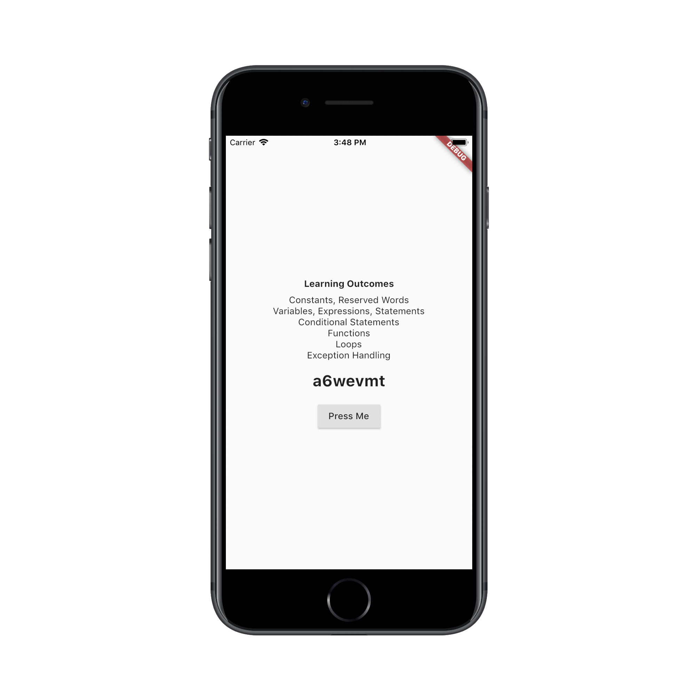

# Flutter Training - Session 1

An introductory session about learning the syntax and semantics of Dart language, which are not very different from the languages we already know.

## Description and Usage

Code here has been annotated with comments for better understanding. 

## Application

